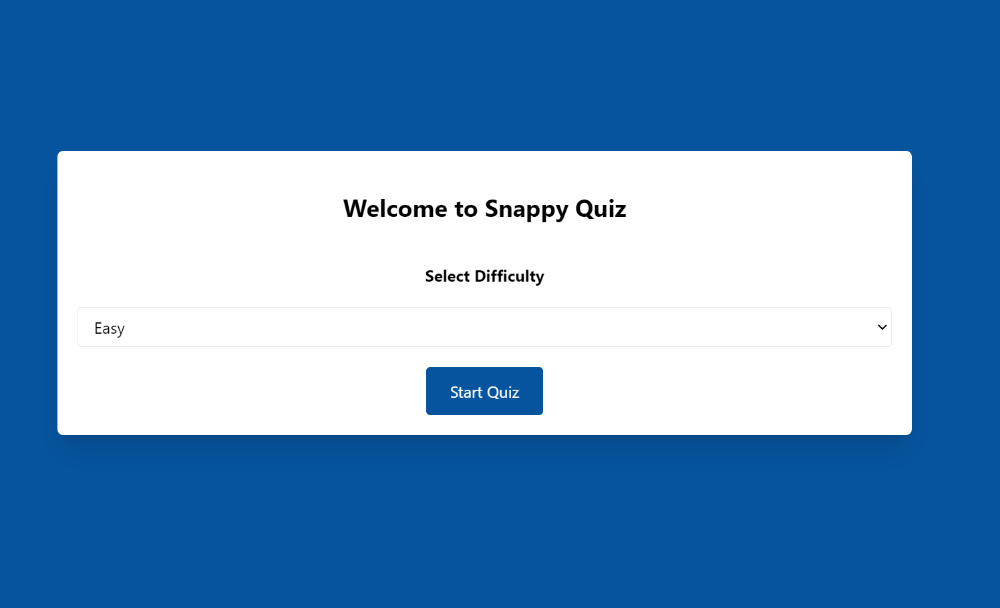
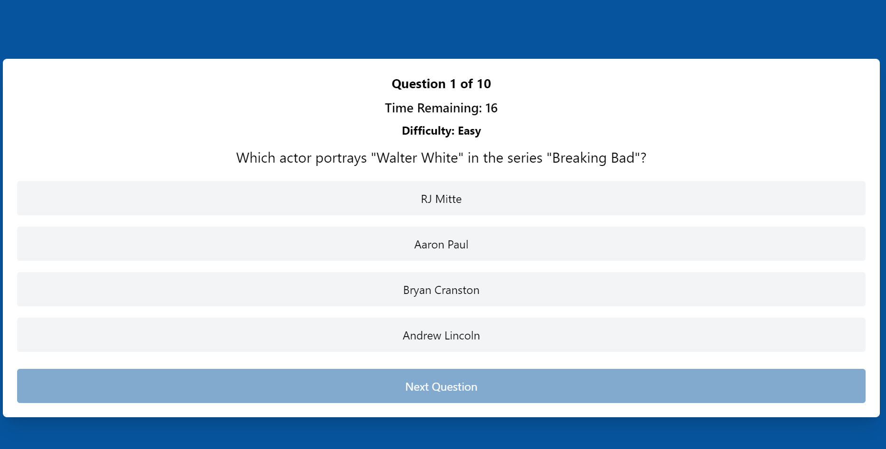
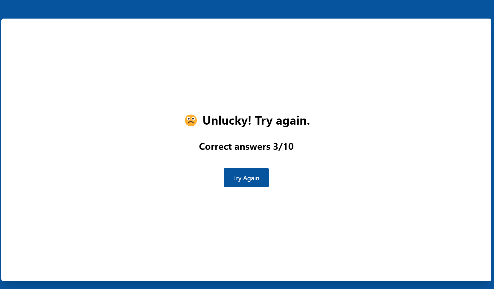

<h1 align="center">Snappy Quiz - Quiz app</h1>

<p align="center">
    Snappy Quiz is a simple and fun quiz game that challenges you with different difficulties,
</p>

## Website & Preview

- [Have a go for yourself! 😊](https://snappy-quiz.vercel.app/)

<h1 align="center">Difficulty Select</h1>
<p align="center">
  
</p>
<h1 align="center">Main Quiz</h1>
<p align="center">
  
</p>
<h1 align="center">Results Page</h1>
<p align="center">
  
</p>

## Library, Frameworks & Tools Used

- [Nuxt 3](https://nuxt.com/)
- [Pinia](https://pinia.vuejs.org/)
- [TailwindCSS](https://tailwindcss.com/)
- [Open Trivia Database](https://opentdb.com/)
- [Vueuse Motion](https://motion.vueuse.org/)
- [Vue Toastification](https://vue-toastification.maronato.dev/)

## Setup & Build

- Clone this project https://github.com/ArunPurewal94/snappy-quiz

```bash
git clone https://github.com/ArunPurewal94/snappy-quiz
```

- Install dependencies (npm, pnpm, yarn)

```bash
npm install
```

```bash
pnpm install
```

```bash
yarn install
```

This project uses the Pinia Store to allow users to:

- Select Difficulty
- Determine the correct/incorrect answer
- Calculate Score at the end

- Run the project

```bash
npm run dev
```

```bash
pnpm run dev
```

```bash
yarn dev
```
